<h1 align="center">Hi 👋, I'm Abdukodir</h1>
<h3 align="center">🚀 Full Stack & AI Engineer | MERN & NestJS Specialist | 4+ Years Experience</h3>

  

  

---

## 🧠 About Me

- 💻 Full Stack & AI Engineer specialized in the **MERN stack** and **NestJS + GraphQL** with 3+ Years Experience
- 💼 Full Stack Developer **Freelance**
- ⚡ Building **scalable, production-grade web applications** — from monoliths to microservices
- 🤖 Growing focus on **AI integrations** (Gemini, OpenAI) and **Python/FastAPI**
- 🤝 Open to collaboration on interesting full-stack & AI projects

---

## 🚀 Tech Stack

### ⚙️ Backend

  

NodeJS, NestJS, ExpressJS, FastAPI, Python, GraphQL (Apollo Server), REST API, MongoDB, Mongoose, PostgreSQL, Prisma, MySQL, Redis, Express-Session, JWT, Bcryptjs, Multer, Socket.IO, Cookie Parser, Dotenv, Form-Data, SQLAlchemy

---

### 🖥 Front-End

  

HTML, CSS, SASS, JavaScript, TypeScript, EJS, ReactJS, Next.js, Vite, Redux, Zustand, Context API, React Native, Apollo Client, JQuery, Axios, Socket.io-Client, Tailwind CSS, Sweetalert2, Sonner, Animejs, React-Router-Dom, Swiper, Motion-Framer, Typed.js, Three.js, TUI Editor, TViewer

---

### 🧠 AI / ML / Agentic

  

PyTorch, OpenCV, NumPy, Pandas, Matplotlib, RAG, Google Gemini API, OpenAI API, python-telegram-bot, APScheduler, Google Colab, MobileNet

---

### 🔌 Integrations

  
  
  
  
  

---

### 🧰 DevOps

  

Linux (Ubuntu), Nginx, DNS, Firewall, Docker, Docker Compose, Let's Encrypt / Certbot, PM2, GitHub Pages, Render

---

### 🏗 Patterns

MVC, Monorepo, Middleware, Dependency Injection, Decorators

---

### 🛠 Tools

  

VSCode, Cursor, Postman, Yarn, NVM, NPM, Z Shell, FileZilla, GitHub, MongoDB Compass, Figma

---

### 🌍 Languages

Korean, English, Uzbek, Russian (elementary level)

---

## 🔥 Featured Projects

### 🏥 MediBridge

🔹 Microservice-based medical tourism marketplace connecting international patients with Korean clinics
🔹 5 services with RabbitMQ + TCP transport, NestJS + GraphQL + MongoDB Atlas
🔹 JWT auth, RolesGuard, clinic verification flow

---

### 🤝 NearHelp

🔹 NestJS monorepo help/services marketplace — **live at [nearhelps.com](https://nearhelps.com)**
🔹 Multilingual platform with AI-powered semantic search
🔹 GraphQL, MongoDB, Socket.io

---

### 🏨 QuickStay

🔹 MERN-stack hotel booking platform — **live at [quickstayhotel.com](https://quickstayhotel.com)**
🔹 Stripe payments with webhook verification, Clerk authentication

---

### 📈 AI Habit Tracker

🔹 AI-powered habit tracking app — **live at [aihabittracker.online](https://aihabittracker.online)**
🔹 React 19 + Vite + Tailwind v4, Gemini-powered insights (RAG-lite)
🔹 Full custom backend with JWT auth

---

### ☕ Caffiora

🔹 Coffee shop ordering application with admin panel
🔹 React + TypeScript + Zustand frontend, Node/Express/MongoDB MVC backend
🔹 Role-based access (User/Admin), order tracking, VIP customer system

---

## 📊 GitHub Analytics

  
  

  

---

## 📈 Contribution Graph

  

---

## 🧠 Currently Learning

- Microservice Architecture at Scale
- AI Agents & RAG Systems
- Advanced System Design

---

## 💬 Quote

> "Code. Build. Scale. Repeat."

---

## 🌐 Connect with me

  
  

